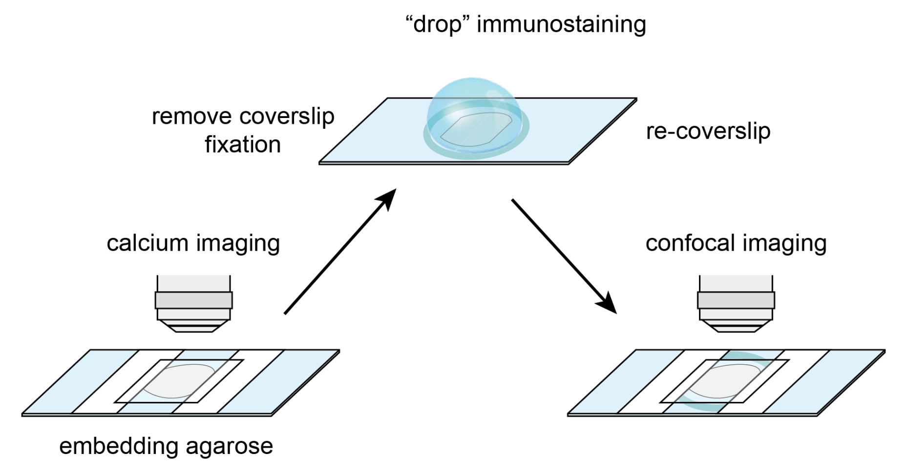
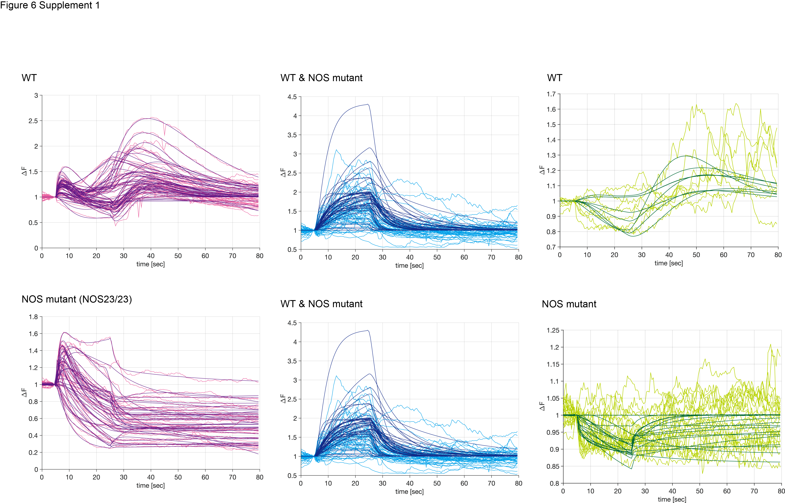
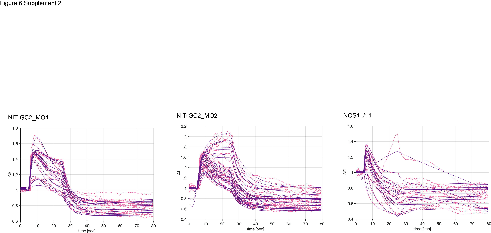
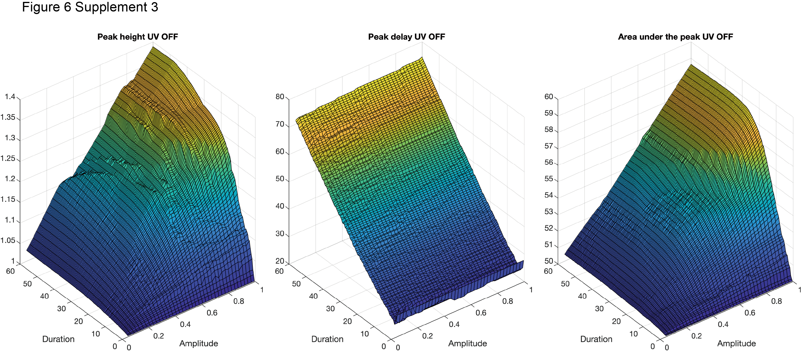

```{r setup, include=FALSE}
knitr::opts_chunk$set(echo = TRUE)

```

{width="100%"}

{width="100%"}

![**Figure 3---figure supplement 1.** **(A)** Overlaid trajectories for WT (n=37) and NOS mutant (NOSΔ11/Δ11, n=18 and NOSΔ23/Δ23, n=8) at two-day-old larvae. 0 sec as the starting point. After 10 sec, UV (395 nm) stimulation from the side. **(B)** The temporal changes in the vertical position of the WT and mutant 2-days-old larvae before and after UV stimulation are shown. The starting points of each larval trajectory are set to 0. After UV stimulation is indicated by purple squares. **(C)** Vertical swimming in wild-type (WT) and mutant (NOSΔ11 and NOSΔ23) larvae at 2-day-old stimulated with UV (395 nm) light from side, blue (488 nm) light from top and UV (395 nm) light from top. The data are shown in 30 s bins. **(D, E)** The temporal changes in the distance traveled of the WT and mutant in 2-day (D) and 3-day-old (E) larvae before and after UV stimulation are shown.](../figures/Fig3_sup1.png){width="100%"}

![**Figure 4---figure supplement 1.** Phylogenetic tree of guanylate cyclase by maximum likelihood (ML). Guanylate cyclase-coupled receptor and soluble guanylate cyclases (sGC) as outgroups. Guanylate cyclases with NIT domains are found in most animal phyla except Porifera, Ctenophora, Urochordata and Chordata. Dot plot of Platynereis NIT-GC genes (columns) expressed in cPRC, INNOS and INRGWa (rows) using single cell RNA-Seq. The size of the dots is expressed in proportion to the percentage of cells expressing that gene relative to all cells. The colours represent the normal logarithm of the number of transcripts in the cells expressing the gene.](../figures/Fig4_sup1.png){width="100%"}

![**Figure 4---figure supplement 2.** **(A)** Co-expression analysis image of the NIT-GC1 (magenta) and MLD-pedal2 amide proneuropeptide gene (MLD: green). Anterior view of the larva at two-day-old. **(B, C)** Expression analysis of the NIT-GC2 gene (magenta) using in situ HCR. Anterior (B) and posterior (C) views of the larva at three-day-old. **(D)** Co-localisation analysis using NIT-GC1 (magenta) and NOS (green) antibodies. Anterior view of the larva at two-day-old. **(E, F)** Localisation analysis using NIT-GC1 and NIT-GC2 antibodies for NIT-GC1 (E) and NIT-GC2 (F) morphant. Green shows co-staining with acetylated α-tubulin antibody (acTub). Anterior view of the larva at two-day-old.](../figures/Fig4_sup2.png){width="100%"}

{width="100%"} {width="100%"}

{width="100%"}

{width="100%"}
