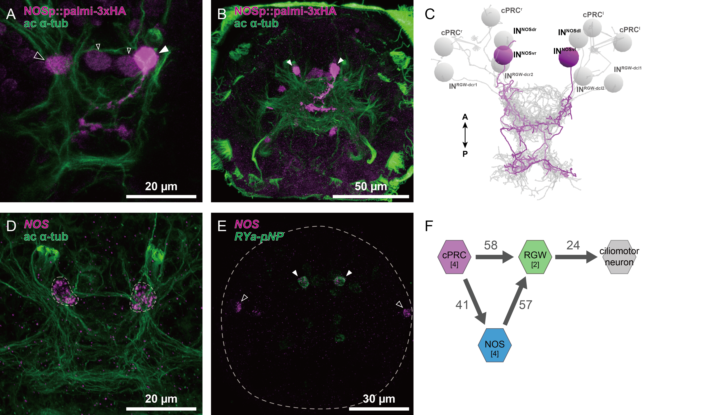
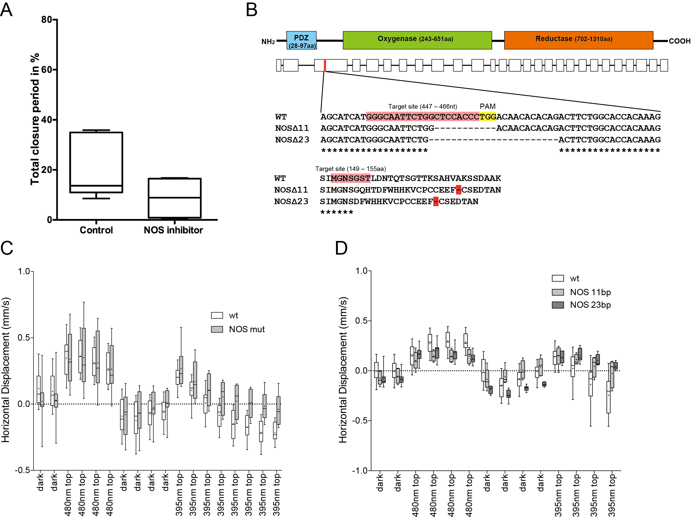
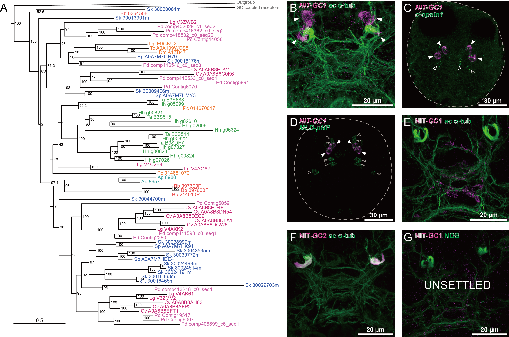
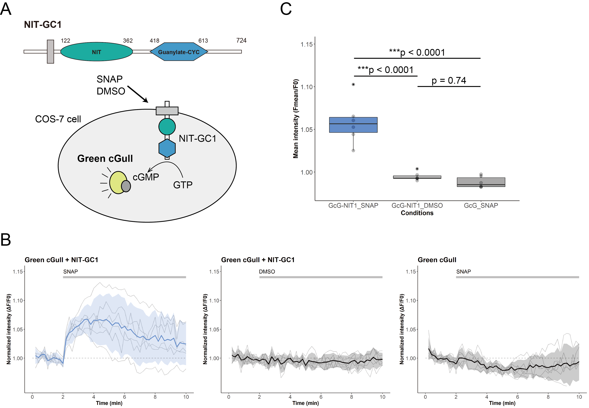
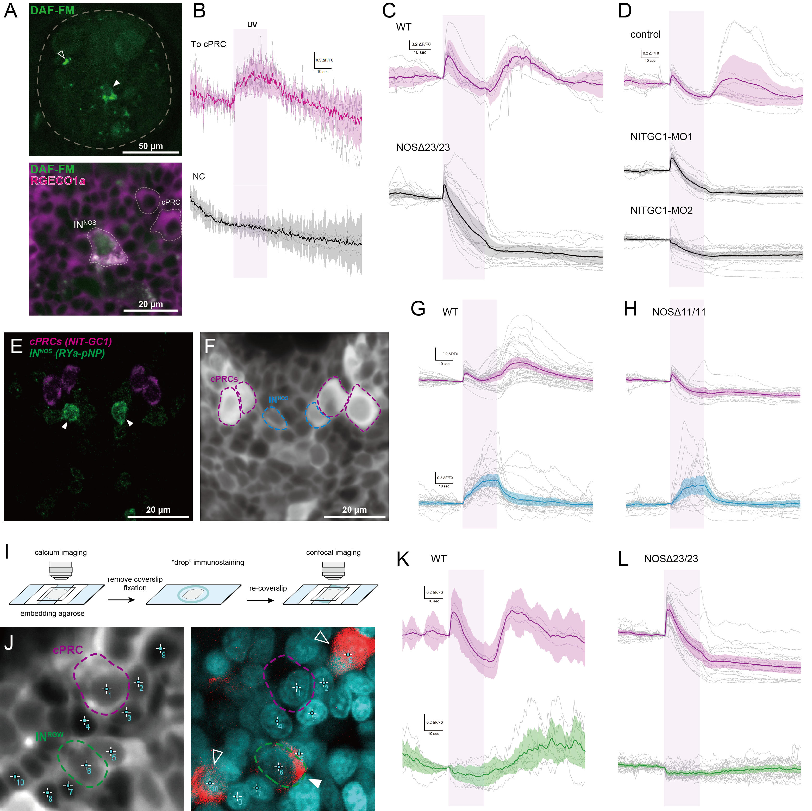
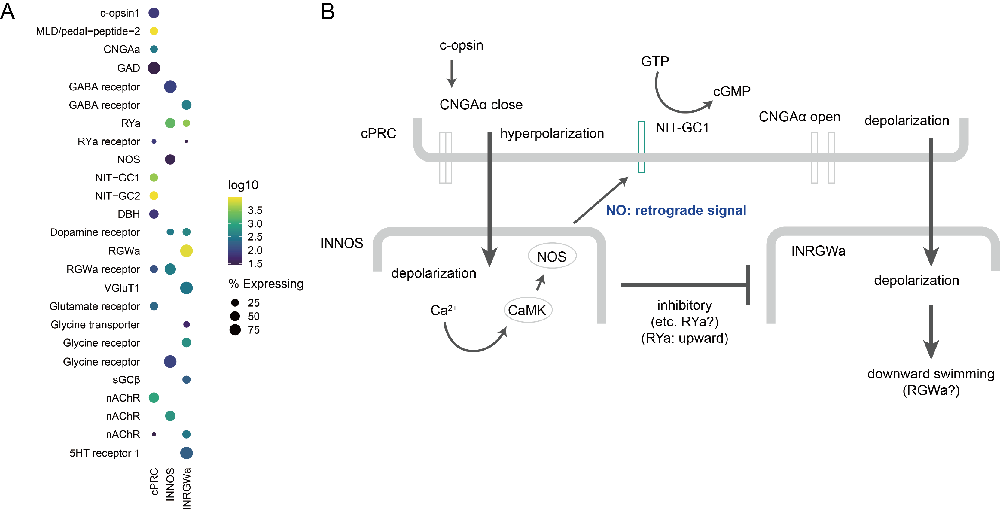

```{r setup, include=FALSE}
knitr::opts_chunk$set(echo = TRUE)

```

## Abstract

Nitric oxide is... Here we show...

## Introduction

add a reference:

*Platynereis dumerilii* is a... [@ozpolat2021]

## Results

**Nitric oxide synthase is expressed in neurons in the cPRC circuit**

First we performed a nitric oxide synthase (NOS) homology search on Platynereis transcriptome data and identified one NOS gene. We examined the gene expression pattern of NOS using in situ hybridization chain reaction (HCR). In the 2-day-old larvae, the NOS gene was strongly expressed in four cells, one pair on the dorsal side and one pair on the ventral side (Fig. 1A). NOS cells were labelled using 12 kbp upstream of the transcription start point of the NOS gene and NOS cells were identified as four interneurons in the ciliary-type photoreceptor cells (cPRCs) circuit from Platynereis reconstruction data (Fig. 1B). We named these NOS interneurons, INNOS (INNOSdl, dr, vl, vr) (Fig. 1C). The cPRC circuit has been reported as a neural circuit involved in c-opsin1 mediated UV avoidance behaviour (Verasztó et al., 2017). INNOS were presynaptic from the cPRCs and postsynaptic to the RGW interneurons in the cPRC circuit (Fig. 1D). To determine whether NO is involved in UV avoidance behaviour, we generated mutant lines with the CRISPR/Cas-9 system and examined their behavioural responses to UV light.

{width="100%"}

**NOS mutant delay from UV avoidance**

We created two mutant lines with different deletions in the third exon of the NOS gene (NOSΔ11/Δ11 and Δ23/Δ23) (Fig. 2A). Compared to wild-type larvae, homozygous NOS mutant larvae have a defective UV-avoidance response (Fig. 2B). Whereas wild-type larvae showed downward swimming behaviour within 30 seconds in response to lateral UV light (UV-avoidance), the NOS mutant larvae showed a delayed onset of this behaviour and a reduced downward swimming speed (Fig. 2B). These results are similar to previously reported responses of UV-avoidance behaviour in c-opsin1 mutants (Verasztó et al., 2017), suggesting that NO is involved in UV-avoidance behaviour via the cPRC circuit. We therefore searched for target molecules for NO.

{width="100%"}

**GCs with NIT (nitrite/nitrate sensing) domains (NIT-GCs) are expressed in cPRC**

Generally, NO can act via cyclic guanosine monophosphate (cGMP) as a second messenger. In this signalling pathway, NO binds to the heme group of soluble guanylate cyclase (sGC), a member of the guanylate cyclase family with a CYC domain (PF00211), to increase cGMP. However, no NO targets were found in cells that highly express sGC within the cPRC circuit. Recently, Moroz and others reported that GC with NIT (nitrite/nitrate sensing) domains (PF08376) (NIT-GC), identified as a sensor for nitrate and nitrite, the oxides of NO, is relatively widely conserved in metazoans (Moroz et al., 2020). To search for NIT-GCs in Platynereis, genes with the CYC domains were searched using the transcriptome and genome sequences of 45 metazoan species and choanoflagellate. By sequence-similarity searches, multiple sequence alignments and cluster analyses, a cluster of membrane-bound (guanylate cyclase-coupled receptor) type was found and a phylogenetic tree was constructed with soluble type (sGC) as an outgroup. As in the phylogenetic analysis of Moroz et al, we found a group of GCs with NIT domains that included many metazoans such as placozoa, cnidaria, ecdysozoa, echinoderms and lophotrochozoa, and in Platynereis 15 NIT-GCs were found (Fig. 3A). To find the candidate NIT-GCs involved in the cPRC circuit among the 15 NIT-GCs, we used previously published spatially mapped single-cell transcriptome data (Achim et al., 2015; Williams et al., 2017) and Two NIT-GCs were found to be highly expressed in the cPRC, and we analysed their expression using in situ HCR as NIT-GC1 and NIT-GC2. As a result, strong signals for both were observed specifically in the vicinity of the cPRCs in 2-day-old larvae (Fig. 3B). Both c-opsin1 and MLD pNP (pedal peptide neuropeptide precursor 2), already identified as cPRC markers, and NIT-GC1 and NIT-GC2 were found to be co-expressed. They were co-expressed c-opsin1 and MLD pNP (pedal peptide neuropeptide precursor 2), already identified as cPRC markers (Fig. 3C) (Arendt et al., 2004; Williams et al., 2017). To analyse localisations at the protein level, immunostaining was performed using polyclonal antibodies against NIT-GC1 and NIT-GC2. Interestingly, NIT-GC1 was found to localise to the neuronal axon and NIT-GC2 to the ciliary region of the cPRC (Fig. 3D and E). Furthermore, co-immunostaining with NOS antibodies revealed that NOS and NIT-GC1 were localised in close proximity in the neurosecretory plexus (Fig. 3F). These results suggest that NIT-GC1 may function as a major target for NO.

{width="100%"}

**NIT-GC1 produces cGMP by nitric oxide**

NIT-GC1 has a highly conserved cyclase domain and activation of NIT-GC1 is expected to produce cGMP. Recently, a synthetic protein called Green cGull was developed as a cGMP indicator that can be used in cultured cell systems (Matsuda et al., 2017). We co-expressed Green cGull and NIT-GC1 in cultured cells COS-7 (monkey kidney) and tested the intracellular dynamics of cGMP in the activation of NIT-GC1 (Fig. 4A). First, S-nitroso-N-acetyl-DL-penicillamine (SNAP; NO donor), 8-Br-cGMP (8-Bromoguanosine 3',5'-cyclic monophosphate; membrane-permeable cGMP analogue, positive control) and DMSO (negative control) were applied to COS-7 cells expressing Green cGull only. 8-Br-cGMP increased fluorescence intensity by more than sixfold, while little changes were detected for SNAP and DMSO (Fig. S4A). Next, the two kind of genes, Green cGull and NIT-GC1, were co-expressed using the 2A self-cleaving peptide and the same solutions were applied. As a result, a clear increase in cGMP fluorescence intensity was detected in SNAP compared to DMSO or expression of Green cGull only, although not as high as the increase in 8-Br-cGMP (Fig. 4B, C). Finally, expression of a mutant form of NIT-GC1 with deletion of the NIT domain significantly suppressed the increase in cGMP (Note, we need re-experiment!, Fig. 4D). These results indicate that NIT-GC1 is activated by NO to produce cGMP. They also show that the NIT domain is required for the activation of NIT-GC1.

{width="100%"}

**NO induces depolarisation of the cPRCs via NIT-GC1**

To determine the function of NO in the cPRC circuit, the intracellular dynamics of neurons in the cPRC circuit were investigated, focusing on NIT-GC1. First, we investigated the changes in NO during UV stimulation of the cPRC using DAF-FM, a fluorescent probe that can detect NO, in order to determine whether NO is produced by UV light. By injecting DAF-FM directly into zygotes, INNOS cells could be identified under live imaging. To visualise the location of cPRCs, the calcium indicator RGECO1a was also injected together, as cPRCs maintain a higher resting calcium levels compared to other cells. Direct UV stimulation to the cPRCs increased the fluorescence intensity of DAF-FM compared to stimulation of non-cPRC region (Fig. 5A). Next, we did calcium imaging of cells in the cPRC circuit during UV stimulation. We locally stimulated the cPRC cilia in wild-type with a 405 nm laser (UV) and detected a slight increase followed by a strong decrease in calcium levels (hyperpolarisation) (Fig. 5B). Turning off the UV after or during the decrease caused a strong increase (depolarisation) and a return to the same calcium level as before (Fig. 5B). These responses were similar to those reported previously (Verasztó et al., 2017). We performed a similar stimulation using NOS mutants, which hyperpolarised during the UV stimulation, but no depolarising responses were observed when UV was stopped (Fig. 5C). Similarly, in NIT-GC1 knockdown larvae using the morpholinos, no depolarisation after the hyperpolarisation response were observed (Fig. 5D). Interestingly, no hyperpolarising response during UV stimulation was found to occur in NIT-GC2 knockdown larvae. And we compared the changes of the INNOS calcium levels identified by their position in relation to cPRCs during UV stimulation in wild-type and in NOS mutants. In both cases, a depolarising response was observed at the same time as the hyperpolarising response of the cPRCs (Fig. 5E). Furthermore, to perform calcium imaging of INRGWs in UV stimulation, INRGWs were identified by immunostaining with RGWa antibodies after calcium imaging (Fig. 5F). It has been reported that the INRGW cells form many large synapses with synaptic vesicles on two serotonergic ciliomotor neurons (Ser-h1) that are known to play a role in the regulation of ciliary beating (Verasztó et al., 2017) and the activity of the INRGW cells increased the negative correlation between the activity patterns of serotonergic neurons and the MC neuron (Williams et al., 2018). The results showed that depolarisation of INNOS occurs at the same time as hyperpolarisation of cPRC in the wild type. Identified INRGW cells were found to cause depolarisation at the same time as cPRC hyperpolarisation in the wild type (Fig. 5G). It was also found that in NOS mutants where cPRC hyperpolarisation does not occur, the INRGW depolarisation response also does not occur (Fig. 5H).

{width="100%"}

## Discussion

In the present study, we explored the role of NO in the UV avoidance behaviour of Platynereis. We demonstrated that there are interneurons expressing NOS in the cPRC circuit and that NO is required for UV avoidance in behavioural experiments using NOS mutants. We identified the axon-localised type NIT-GC1 and the cilia-localised type NIT-GC2 expressed in the cPRCs as targets of NO and showed from cultured cell experiments that these produce cGMP in response to NO. We have shown by calcium imaging that INNOSs are activated in response to the hyperpolarising response of the cPRCs, that the NO produced feeds back to the cPRC via NIT-GC1 and induces a depolarising response in the cPRC, and that the depolarising response of the cPRC is involved in activating downstream INRGW. Lastly, we confirmed that RGWamide induces the downward swimming behaviour of larvae.

cPRCs expressing UV-absorbing c-opsin1 have high resting calcium levels and show hyperpolarising and subsequent depolarising responses to UV light (405 nm) (Verasztó et al., 2018). In the present study, we have shown that the cells that strongly synapse with cPRCs are interneurons that specifically express NOS (INNOS). The fluorescence intensity of DAF-FM, which specifically detected INNOS, showed a transient tonic-like increase dependent on UV stimulation of the cPRCs. The graph shows a decrease in intensity after UV light is switched off, but the response of DAF-FM to NO is irreversible and this decrease is due to breaching by the relatively strong excitation light. Attempts to measure changes in the intensity of the calcium indicator RGECO1a simultaneously with DAF-FM imaging did not lead to detection of changes in fluorescence intensity compared to GCaMP6s and could only visualise the cPRCs. In calcium imaging using GCaMP6s, INNOS identified by the positional relationship between the cPRC and INNOS and the labelling of RYa depolarised in clear synchrony with the hyperpolarising response of the cPRCs. This tonic response may involve dopaminergic nerves based on single-cell data (Fig) (Puopolo et al., 2001, Zhang et al., 2007, Randel et al., 2014). In the mammalian retina, it is known that signals from bipolar photoreceptor cells are transmitted to downstream NOS-expressing amacrine cells (NOAC), where NO is produced (Jacoby et al., 2018, Neuron). These suggest that UV stimulation of cPRCs causes the production of NO via a depolarising response of INNOS.

Our results suggest that NIT-GC1, which is specifically expressed in cPRCs, functions as a target for NO produced by INNOS and contributes to the regulation of the cPRC circuit transmission pathway via a depolarising response by increasing cGMP. In the mammalian retina, NO is an essential signalling molecule and one of the most well-studied (Cudeiro and Rivadulla, 1999). It has been reported that NO produced in one of the retinal cells modulates cGMP-mediated neurotransmission by activating presynaptic neural sGCs (general target of NO) through retrograde signalling (Vielma et al., 2014; Wei et al., 2012). In Platynereis cPRC, NIT-GC1 was also identified as having the property of producing cGMP in a NO-dependent manner. Furthermore, it is known that CNGAα, one of the cyclic nucleotide-gated channels, is specifically highly expressed in cPRC (Tosches et al., 2014), and in INNOS-cPRC signalling, NO is implicated in the neuromodulation of the cPRC by retrograde signalling. 
NO is a molecule with a very short half-life, and when functioning as a signalling molecule, NOS and sGC are known to localise very close together at synapses between neurons (Burette et al., 2002; Garthwaite., 2016). In our study, we found 12 sGCs in Platynereis, but none expressed in the cPRC. Localisation analysis of NOS and NIT-GC1 by antibody staining showed that the two proteins localised very close together in the anterior neurosecretory plexus region. Calcium imaging results using NOS mutant and NIT-GC1 knockdown larvae suggest that NIT-GC1 activation induces a depolarising response in the cPRC.

Another type of interneuron that strongly synapses with the cPRC is the INRGWa, which synapses directly onto the ciliomotor neuron and is therefore considered to be a very important neuron in the control of larval behaviour (Verasztó et al., 2018, Williams et al., 2018). The present results suggest that the depolarising response of the cPRC due to NO feedback induces INRGW activation. RGWamide is also a neuropeptide that induces larval downward swimming quite strongly (unpublished? need to show data?), and the delayed downward swimming of NOS mutant larvae in response to UV stimulation may be responsible for the failure of INRGW activation to occur. In addition, in many marine invertebrates, NO has been reported to be involved in many aspects of settlement behaviour and metamorphosis induction (1, 2, 3, 4, 5, 6, 7, 8, 9, 10). The downward swimming behaviour of Platynereis larvae is the first step in the onset of settlement behaviour and metamorphosis. These suggest that downward swimming due to NO activation of INRGWs may trigger the onset of settlement behaviour and metamorphosis (Conzelmann et al., 2013, Williams et al., 2015). These suggest that NO feedback signalling may act as a trigger for downward swimming via activation of INRGWs, which induces the initiation of settlement behaviour and metamorphosis.

An outstanding question is how the NO~NIT-GC response alters neuronal dynamics. NO is a single molecule and, due to its short half-life, cannot be transmitted over long distances and has a limited signalling repertoire. It has therefore been considered unsuitable for generating diversity in signalling compared to other signalling molecules such as neuropeptides and classical neurotransmitters (Jekely, 2021). However, our results in the present study indicate that NO-induced activation of NIT-GC1 is involved in the regulation of neuronal circuits (cPRC pathway). The NIT domain was originally found in bacteria and the existence of GCs with NIT domains was first reported by Moroz et al in 2020 (Shu et al., 2003; Moroz et al., 2020). It has been proposed that NIT domains in bacteria regulate cellular functions in response to changes in extracellular and intracellular nitrate and/or nitrite concentrations (Camargo et al., 2007). In fact, NO is a free radical molecule, with a half-life of 5 msec in vivo, and is readily converted to nitrate and nitrite (Santos et al., 2011; Garthwaite., 2016; Möller et al., 2019). And nitrate and nitrite have been reported to accumulate in cells and tissues with high NOS activity in placozoans and cnidarians (Moroz et al., 2004; Moroz et al., 2020). It is possible that the NIT domains of NIT-GC1 identified in this study may also be used for nitrate/nitrite sensing, as in bacteria. Furthermore, if they show different sensitivities to NO, nitrite and nitrate, it is possible that the temporal variation in their respective half-lives could give rise to a repertoire of activation timings (Lundberg  et al., 2011). In addition, we have found at least 15 NIT-GCs in the Platynereis transcriptome data, of which NIT-GC2 is highly expressed in the cPRC, in addition to NIT-GC1. Interestingly, NIT-GC2 showed a very different localisation pattern to NIT-GC1, and furthermore, the results of calcium imaging of cPRC in response to UV stimulation using NIT-GC2 knockdown larvae were the different dynamics (such that hyperpolarisation was suppressed) with NIT-GC1 knockdown. It was not clear from the present analysis whether this difference was due to differences in the localisation or the property of the NIT-GCs. However, the diversification and spatially different localisation patterns of NIT-GCs may increase their signalling repertoire. We also believe that the appearance of NIT-GCs was one of the means to generate the diversity of signalling pathways using NO during the early stages of nervous system evolution in metazoans, since sponges and ctenophores, where NO signalling is present, have no NIT-GCs at all, as many as 12 have been found in placozoans, and NIT-GCs are functional in the “proto-eye” circuit of Platynereis.

{width="100%"}

## Materials and Methods

**CRISPR-Cas9 Design and Microinjection**

Before designing the small guide RNA (sgRNA) for the sgRNA:Cas9 nuclease, splice sites and polymorphic sites in our laboratory culture were identified to avoid them. The sgRNA targeted the third exon of Platynereis dumerilii NOS (target site: 5'-GGGCAATACTGGCTCCACTC-3'). The sgRNA was assembled from two annealed oligonucleotides (5'-TAGGGCAATACTGGCTCCACTC-3', 5'-AAACGAGTGGAGCCAGTATTGC-3') forming overhangs for cloning into a BsaI site of the plasmid pDR27456 (Hwang et al. 2013)(42250, Addgene), which contains next to the BsaI site a tracrRNA sequence. The plasmid was then used to PCR amplify DNA (primers: T7, 5'-AAAAGCACCGACTCGGTGCC-3') for synthesizing the sgRNA. The DNA was purified with the QIAquick PCR Purification Kit (Qiagen). From the DNA, the sgRNA was synthesized with the MEGAshortscript Kit (Thermo Fisher Scientific) and was purified with the MEGAclear Kit (Thermo Fisher Scientific). Cas9-mRNA was transcribed, capped, and polyA-tailed with the mMessage mMachine Kit and the Poly(A) Tailing Kit (both Thermo Fisher Scientific) from a plasmid (pUC57-T7-RPP2-Cas9) containing the Cas9 ORF fused to 169 base pair 5' UTR from the Platynereis dumerilii 60S acidic ribosomal protein P2. The sgRNA (18 ng/ml) and the Cas9-mRNA (180 ng/µl) were coinjected into fertilized eggs of Platynereis dumerilii wild-type parents according to an established injection procedure (Conzelmann et al. 2013). The eggs were kept at 18°C for 45 min before injection and were injected at 14.5°C. The injected individuals were kept at 18°C for 5 to 8 days in 6-well- plates (Nunc multidish no. 150239, Thermo Scientific) and then cultured at 22°C until sexual maturity. The mature worms were crossed to wild-type worms and the progeny was genotyped, resulting in two founder lines, which were bred to homozygosity.

**NOS sequencing and genotyping**

For genotyping of the NOS locus, genomic DNA was isolated from single larvae, groups of 6-20 larvae, or from the tails of adult worms. The DNA was amplified by PCR (primers: 5'-GGTTCATTGGTTTCGATAACATTGCGG-3', 5'-CAGAGTCGATCAGTCTGCATATCTCCA-3') with the dilution protocol of the Phusion Human Specimen Direct PCR Kit (Thermo Scientific). The PCR product was sequenced directly with a nested sequencing primer (5'-GGTGCTCTCCCGGGTACACAA-3'). A mixture of wild-type and deletion alleles in a sample gave double peaks in the sequencing chromatograms, with the relative height of the double peaks reflecting the relative allele ratio in the sample.

**Vertical column setup for pharmacology**

Freely swimming 2-day-old larvae were recorded in 5 adjacent vertical columns (each 31 mm x 10 mm x 144 mm water height) with a DMK 21BF03 camera (The Imaging Source) at 30 frames/s. The columns were illuminated laterally with red (633 nm) light-emitting diodes (LEDs). This light cannot be detected by 2-day-old larvae. The larvae were treated with NOS inhibitors and NO donors. The NOS inhibitors were L-NAME, SMIS, and AGH. The NO donors were SNAP and NONOate. The larvae were treated with different concentrations in adjacent columns. The concentrations for the NOS inhibitors were control, 10 mM, 1 mM, 0.1 mM, and 0.01 mM; for SNAP were control, DMSO control, 1 mM, 0.1 mM, and 0.01 mM; and for NONOate were control 1 mM, 0.1 mM, and 0.01 mM. The larvae were recorded for 30 s then the drugs were added. 30 s, 1 min, 1 h, and 2 h later, the larvae were recorded again for 30 s. The larvae were tracked and their vertical displacement was calculated. Scripts are available at <https://github.com/JekelyLab/NOS>.

**Vertical column setup for measuring photoresponses**

Photoresponses of larvae of different ages were assayed in a vertical Plexiglas column (31 mm x 10 mm x 160 mm water height). The column was illuminated from top with light from a monochromator (Polychrome II, Till Photonics). The monochromator was controlled by AxioVision 4.8.2.0 (Carl Zeiss MicroImaging GmbH) via analog voltage. The light passed a collimator lens (LAG-65.0-53.0-C with MgF2 Coating, CVI Melles Griot) before entering the column. The column was illuminated from both sides with light-emitting diodes (LEDs). The LEDs on each side were grouped into two strips. One strip contained UV (395 nm) LEDs (SMB1W-395, Roithner Lasertechnik) and the other infrared (810 nm) LEDs (SMB1W-810NR-I, Roithner Lasertechnik). The UV LEDs were run at 4 V to stimulate the larvae in the column from the side. The infrared LEDs were run at 8 V (overvoltage) to illuminate the larvae for the camera (DMK 22BUC03, The Imaging Source), which recorded videos at 15 frames per second and was controlled by IC Capture (The Imaging Source).

**Comparing behavior of wildtype and NOS-knockout 3-day-old larvae**

To compare the behavior of wildtype and NOS-knockout larvae at 3 days in the vertical column, the larvae were mixed and left in the dark for 5 min. The larvae were recorded for 1 min in the dark followed by exposure to collimated cyan (480 nm) light from the top of the column for 2 min, then 2 min darkness, and finally collimated UV (395 nm) light from the top of the column for 2 min. Stimulus light was provided by the monochromator (Polychrome II, Till Photonics). Scripts are available at <https://github.com/JekelyLab/NOS>.

**In situ HCR**

Larvae were fixed and treated with Proteinase K, according to the conventional WMISH protocol (Tessmar-Raible et al., 2005), with fixation in 4% paraformaldehyde/ PTW (PBS with 0.05% Tween20) for 2 hr at room temperature, and Proteinase K treatment in 100 µg/ml Proteinase K/ PTW for 3 min (Tessmar-Raible et al., 2005). Specifically, for the HCR protocol, samples were processed in 1.5 ml tubes. Probe hybridization buffer, probe wash buffer, amplification buffer, and fluorescent HCR hairpins were purchased from Molecular Instruments (Los Angeles, USA). Hairpins associated with the b2 initiator sequence were labeled with Alexa Fluor 647, and the hairpins associated with the b3 initiator sequence were labeled with Alexa Fluor 546. To design probes for HCR, we used custom software (Kuehn et al., 2021) to create 20 DNA oligo probe pairs specific to P. dumerilii NOS, NIT-GC1, NIT-GC2, RYa-pNP (GenBank accession: JF811330.1), c-opsin1 (GenBank accession: AY692353.1), CNGAα (GenBank accession: KM199644.1), and MLD/pedal2-pNP (GenBank accession: KF515945.1). The NOS, NIT-GC1 and NIT-GC2 probes were designed to be associated with the b2 initiator sequence, while the RYa-pNP, c-opsin1, CNGAα and MLD/pedal2-pNP probes were designed to be associated with the b3 initiator sequence. For the detection stage, samples were pre-hybridized in 200 µl of probe hybridization buffer for 1 hr at 37°C, and then incubated in 250 µl hybridization buffer containing probe oligos (4 pmol/ml) overnight at 37°C. To remove excess probe, samples were washed 4× with 1 ml hybridization wash buffer for 15 min at 37°C, and subsequently 2× in 1 ml 5× SSCT (5× SSC with 0.1% Tween20) for 5 min at room temperature. For the amplification stage, samples were pre-incubated with 100 µl of amplification buffer for 30 min, room temperature, and then incubated with 150 µl amplification buffer containing fluorescently labeled hairpins (40nM concentration (2ul of 3uM stock in 150ul amplification buffer, snap-cooled as described; Choi et al., 2018) overnight in the dark at 25°C. To remove excess hairpins, samples were washed in 1 ml 5× SSCT at room temperature, twice for 5 min, twice for 30 min, and once for 5 min. During the first 30 min wash, samples were counterstained with DAPI (Cat. #40043, Biotium, USA).

**Immunohistochemistry**

Whole-mount immunostaining of 2 day old Platynereis larvae fixed with 4% paraformaldehyde were carried out using primary antibodies raised against NIT-GC1, NIT-GC2, NOS, RYamide neuropeptide, RGWamide neuropeptide in rabbit, plus a commercial antibody raised against acetylated tubulin in mouse (Sigma T7451). The synthetic peptides contained an N-terminal Cys that was used for coupling during purification. Antibodies were affinity purified from sera as previously described (Conzelmann and Jékely 2012). Immunostainings were carried out as previously described (Conzelmann and Jékely 2012).

**Calcium imaging**

For calcium imaging, 49--55 hpf larvae were used. Experiments were performed at room temperature and larvae were immobilised by being embedded in 2.5% agarose filtered artificial seawater between a slide and coverslip spaced with adhesive tape. GCaMP6s mRNA (1 mg/ml) was injected into zygotes as described previously (Randel et al., 2014). Larvae were imaged on a Zeiss LSM 880 with Airyscan (with a C-Apochromat 63X/1.2 Corr - water) with a frame rate of 1.88 frame/sec and an image size of 512 x 512 pixels. The larvae were stimulated in a region of interest (a circle with ?? pixel diameter) with 405 nm lasers controlled by the Bleaching mode. The imaging laser had a similar intensity than the stimulus laser but covered an area that was ?? times larger than the stimulus ROI.

**Cell culture experiment**

Green cGull was used for the cGMP assay (Matsuda et al., 2017). A full-length Pdum-NIT-GC1 and -NIT-GC2 coding sequences were amplified by PCR starting from a Platynereis dumerilii cDNA library and cloned into the pcDNA3.1(+) vector using the T2A self-cleaving sequence. Cos-7 cells with low expression of endogenous soluble guanylate cyclase were used as cultured cells for gene expression. This cell line was purchased from Angio-proteomie (CAT no. cAP-0203). The Cos-7 cells were maintained at 37 °C in 35mm dishes (Nunc™ Glass Bottom Dishes) containing 3 mL of DMEM, high glucose glutamax medium (Thermo; Cat. No. 10566016) supplemented with 10% fetal bovine serum (Thermo; Cat. No. 10082147). Upon reaching confluency of approximately 85%, we transfected the cells with the plasmid containing Green cGull-T2A-NITGC1. Transfections were carried out with 150 ng of each plasmid and 0.3 μl of the transfection Lipofectamine 3000 Reagent (invitrogen; Cat. No. ???). Two days post-transfection, we removed the culture medium and substituted it for fresh DMEM-medium. For single-wavelength imaging experiments, cells in 35-mm dishes were washed twice and imaged in modified Ringer's buffer (140 mM NaCl, 3.5 mM KCl, 0.5mM NaH2PO4 , 0.5mM S-3 MgSO4 , 1.5 mM CaCl2 , 10 mM HEPES, 2 mM NaHCO3 and 5 mM glucose). Dishes were mounted on a stage heated at 37 °C and imaging was performed using an inverted microscope (LSM880, Zeiss) equipped with an oil-immersion objective lens (UApo/340, 40, NA = xx). Images were acquired using a xenon lamp, 460--495 nm excitation filter, 505-nm dichroic mirror and 510-- 550-nm emission filter (????). 8-br-cGMP and S-Nitroso-N-acetyl-D, L-penicillamine (SNAP) were purchased from Sigma-Aldrich (St. Louis, MO, USA) and Cayman Chemical (Ann Arbor, MI, USA). The exposure time of the EM-CCD camera was controlled by the ZEN software (Zeiss). Images were acquired every 15 s for 10 min and stimulation was initiated 2 min after starting image acquisition. Imaging data analysis was performed using ImageJ (National Institutes of Health, Bethesda, MD, USA).

## Acknowledgements

This work was funded by the Wellcome Trust (214337/Z/18/Z).

## References {.unnumbered}

::: {#refs}
:::
