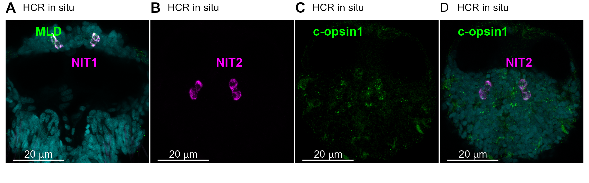
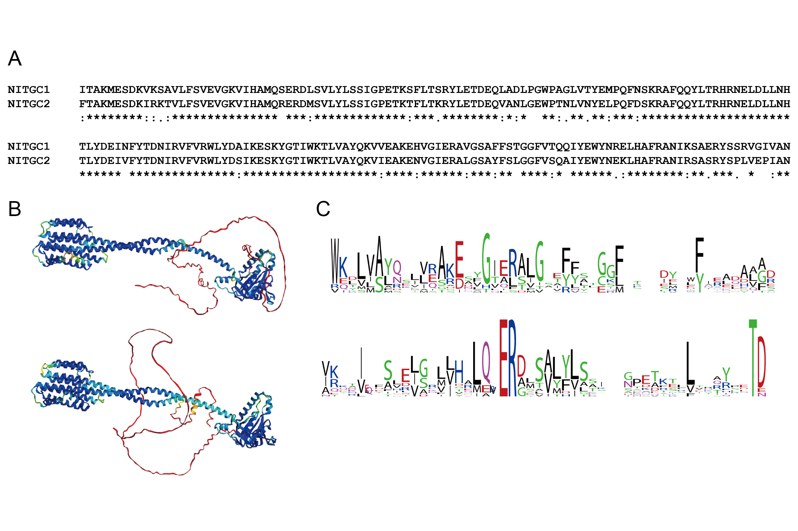

```{r setup, include=FALSE}
knitr::opts_chunk$set(echo = TRUE)

```

![**Figure 1---figure supplement 1.** (A) Phylogenetic tree of NOS by maximum likelihood (ML). Tree robustness was tested with 1000 replicates of ultrafast bootstrap. Species names are as follows: Ap (Aiptasia pallida), Bb (Branchiostoma belcheri), Cv (Crassostrea virnigica), Dm (Drosophila melanogaster), Dp (Daphnia pulex), Hh (Hoilungia hongkongensis), Lg (Lottia gigantea), Pc (Priapulus caudatus), Pd (Platynereis dumerilii), Sk (Saccoglossus kowalevskii), Sp (Strongylocentrotus purpuratus), Ta (Trichoplax adhaerens), Tc (Tribolium castaneum).](../figures/Fig1_sup1.png){width="100%"}

{width="100%"}

![**Figure 3---figure supplement 1.** (A) Phylogenetic tree of guanylate cyclase by maximum likelihood (ML). Guanylate cyclase-coupled receptor and soluble guanylate cyclase as outgroups. Guanylate cyclases with NIT domains are found in most animal phyla except Porifera, Ctenophora, Urochordata and Chordata. Tree robustness was tested with 1000 replicates of ultrafast bootstrap. Species names are as follows: Ap (Aiptasia pallida), Bb (Branchiostoma belcheri), Cv (Crassostrea virnigica), Dm (Drosophila melanogaster), Dp (Daphnia pulex), Hh (Hoilungia hongkongensis), Lg (Lottia gigantea), Pc (Priapulus caudatus), Pd (Platynereis dumerilii), Sk (Saccoglossus kowalevskii), Sp (Strongylocentrotus purpuratus), Ta (Trichoplax adhaerens), Tc (Tribolium castaneum).](../figures/Fig3_sup1.png){width="100%"}

{width="100%"}

{width="100%"}

{width="100%"}

{width="100%"}

![**Figure 4---figure supplement 2.** (A) Schematic diagram of the immunostaining procedure after calcium imaging. (B) The position of the cPRC (purple dashed line) in calcium imaging with GCaMP6s. Cells around the cPRC are numbered according to the position of the nuclei. (C) Immunostaining image using RGWamide (RGWa) and serotonin (Ser) antibodies (red) and DAPI (light blue) in the same region as (B). INRGW (green dashed line) and Ser-h1 (black arrowheads) identified from the numbered nuclear positions are shown.](../figures/Fig4_sup2.png){width="100%"}
