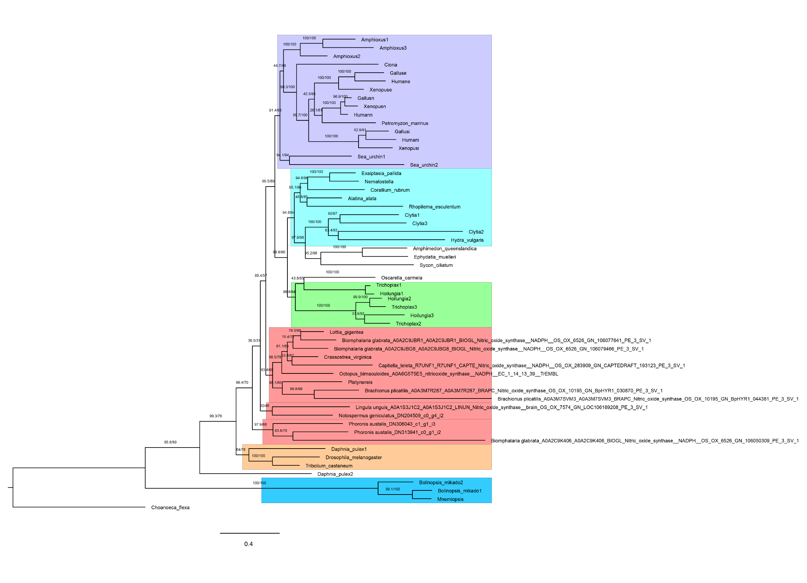
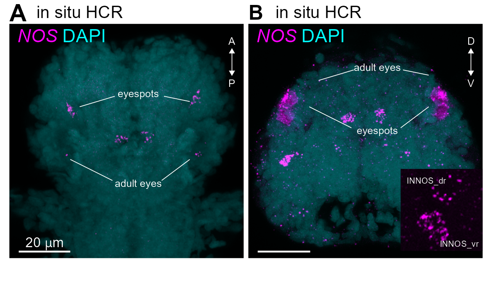

```{r setup, include=FALSE}
knitr::opts_chunk$set(echo = TRUE)

```

{width="100%"}

{width="100%"}

{width="100%"}

{width="100%"}

![**Figure 4---figure supplement 2.** (A) Immunostaining with NOS antibodies. (B) Co-expression analysis image with the RYamide proneuropeptide gene (RYa-pNP: green), which is highly expressed in INNOS. White arrowheads indicate co-expressed INNOS. Black arrowheads indicate larval eyes. White dashed lines indicate the outer frame of the larva. (A) Co-expression analysis image of the MLD-pedal2 amide proneuropeptide gene (MLD-pNP: green). Black arrowheads indicate cells different from cPRC. (B) Co-localisation analysis using NIT-GC1 and NOS antibodies.](../figures/Fig4_sup2.png){width="100%"}
